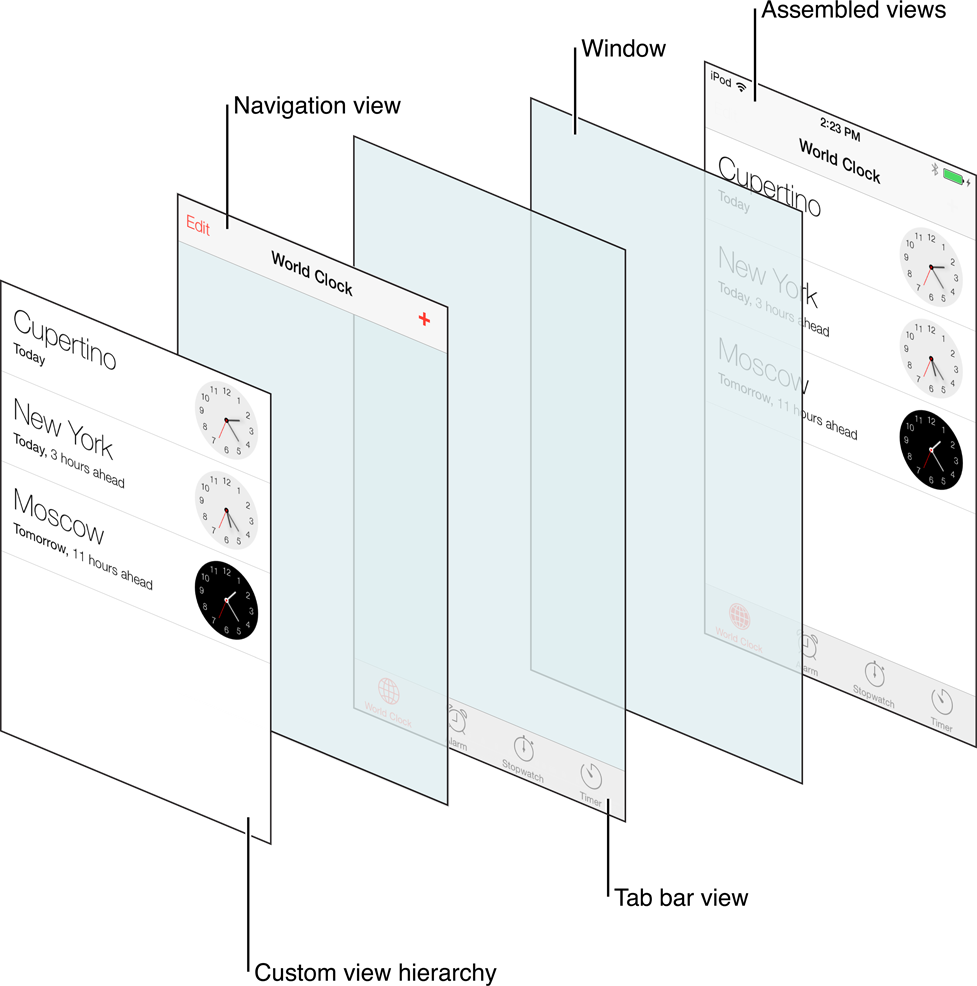
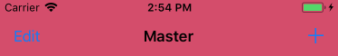
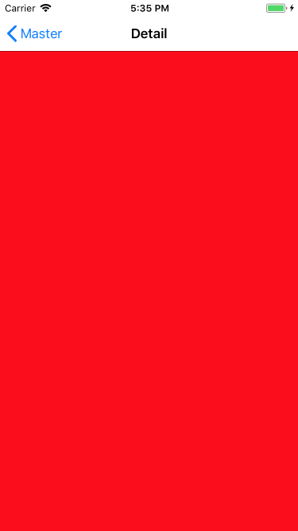
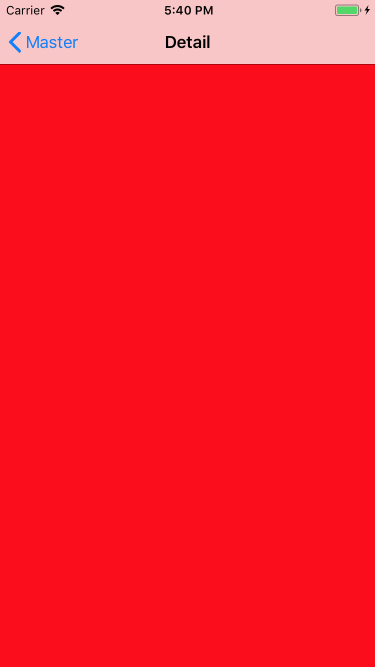
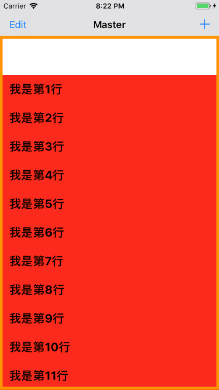
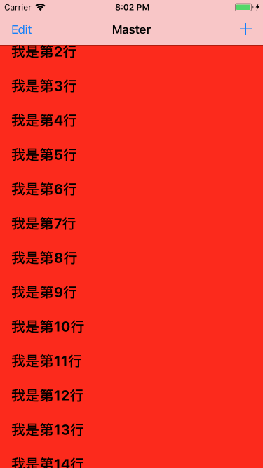

从iOS7开始苹果加入了毛玻璃特性，从此界面上就出现了两块毛玻璃：navigationBar和tabBar，从此踩坑踩不停哇，原因都是 `UIViewController`和`UIScrollView`的几个属性没搞清楚，这里总结一下有关的注意点，还真挺容易忘记的。
<!--more-->
状况都出在UINavigationController和UITabBarController
先上UIView的层级关系：


## NavigationBar色差
先说给`NavigationBar`上色时常踩的坑是:
```swift
[self.navigationController.navigationBar setBarTintColor:UIColor(r, g, b)]
```
实际运行的效果和设计图会出现色差

设计图色值

实际运行色值


原因是iOS7及以上对`NavigationBar`进行了高斯模糊处理，有一定的透明度,而Bar下面的视图默认是白色的，所以使得Bar看着颜色较淡

解决的思路可以这样：
1. 在设计稿上截取小1个px的图片
2. 把该图片平铺到navigationbar上，当backgroundImage用
```swift
self.navigationController?.navigationBar.setBackgroundImage(UIImage(named: "Navigation_BackgroundImage"), for: .default)
```

还有另一种思路是可以关闭`navigationBar`的`translucent`特效：
```swift
[self.navigationController.navigationBar setBarTintColor:UIColor(r, g, b)]
self.navigationController.navigationBar.translucent = NO
```

## UIViewController的edgesForExtendedLayout属性
上面提到navigationBar的是半透明，可以隐约看到Bar后面的内容，这样也算提高了屏幕的利用空间吧。
记得在iOS 6中，ViewController的view是从navigationBar底部开始布局的，如果我们设置view的背景色是红色的话，效果应该是这样的

但是到了iOS 7中，ViewController的view是从屏幕顶部开始布局的，效果是这样

这是因为在iOS 7中，苹果引入了一个新的属性，叫做[UIViewController setEdgesForExtendedLayout:]，它的默认值为UIRectEdgeAll。
其实我们一般用的`navigationBar`其实并不需要系统的毛玻璃特效，或者每次手动布局的时候，布局subViews的时候都要加上64pt，甚是麻烦
下面的代码可以恢复iOS 6的布局
```swift
self.edgesForExtendedLayout = UIRectEdgeNone;
```

## automaticallyAdjustsScrollViewInsets与contentInsetAdjustmentBehavior属性
因为iOS7的透明化，苹果为了配合`UIScrollView`的滚动，`navigationBar`透明后可以看到下面内容的滚动，自动为`UIViewController`开启了`automaticallyAdjustsScrollViewInsets`，这时导航栏、状态栏就不会挡住后面的滚动视图了，`scrollView`的ContentInset会，自动把我们的内容（cell、滚动视图里的元素）向下偏移离Top64pt（下方位置如果是tarbar向上偏移离Bottom49pt、toolbar是44pt)

下面有个我经常遇到的一种坑:


`UITableView`或者`UICollectionView`，会被导航栏挡住或者神奇的下移了64pt

这两种情况其实都是因为`edgesForExtendedLayout`和`automaticallyAdjustsScrollViewInset`的搭配出了问题，`edgesForExtendedLayout`控制的是UIViewController.view的`frame`，`automaticallyAdjustsScrollViewInset`控制的是`UIScrollView`内部的内容了

图1有两种可能
一种是对`edgesForExtendedLayout`设置了
```swift
self.edgesForExtendedLayout = UIRectEdgeNone
tableView.frame = CGRect(x: 0, y: 0, width: UIScreen.main.bounds.width, height: UIScreen.main.bounds.height)
```

还有一种是没有对`edgesForExtendedLayout`进行设置的，这里`tableView`从`navigationBar`底部开始布局的
```swift
tableView.frame = CGRect(x: 0, y: 64, width: UIScreen.main.bounds.width, height: UIScreen.main.bounds.height)
```

`ScrollView`的`frame`没有问题，问题肯定就是在于iOS7为我们对`ContentInset`的自动调整上了
```swift
self.automaticallyAdjustsScrollViewInsets = NO;//    自动滚动调整，默认为YES
```
从iOS 11开始，苹果又有新变化，看文档`automaticallyAdjustsScrollViewInsets`已经废弃了，而是给`UIScrollView`增加了`contentInsetAdjustmentBehavior`属性
```swift
if (@available(iOS 11.0, *)) {
    _tableView.contentInsetAdjustmentBehavior = UIScrollViewContentInsetAdjustmentNever;
}else {
    self.automaticallyAdjustsScrollViewInsets = NO;
}
```
图2是在`edgesForExtendedLayout`在默认值`UIRectEdgeAll`下，又把"automaticallyAdjustsScrollViewInsets"关闭了，没有了`ContentInset`，内容就被导航栏遮盖了iOS11的`contentInsetAdjustmentBehavior`默认是`UIScrollViewContentInsetAdjustmentAutomatic`，其实已经解决了上面的一些问题了
