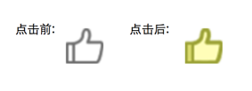

在类似点赞或切换浏览模式等功能的时候,需要用到button的选中状态:即点击后按钮切换图片,并保持这个状态,直到下一次点击.
如:


接下来我们就以这两个图片为例子.
已知点击前那张图片名字是like.png,简称"like",
嫩绿色那张图片名字是like_selected.png,简称为"like_selected".

初学者可能的做法

创建button的时候设置normal状态下的图片为like,点击后重新设置normal状态下的图片为like_selected,代码如下:
```Objective-C
// 省略了部分非关键代码
[button setImage:[UIImage imageNamed:@"like"] forState:UIControlStateNormal];
[button addTarget:self action:@selector(buttonClick:) forControlEvents:UIControlEventTouchUpInside];

- (void)buttonClick:(UIButton *)button {
    if ([button.currentImage isEqual:[UIImage imageNamed:@"like"]]) {
        [button setImage:[UIImage imageNamed:@"like_selected"] forState:UIControlStateNormal];
    }
    else {
        [button setImage:[UIImage imageNamed:@"like"] forState:UIControlStateNormal];
    }
}
```
虽然我也曾经写过这样写过(往事不堪回首...),虽然是可以勉强达到要求,但不得不承认,这是一段糟糕的代码,强烈不建议大家使用.

进阶做法

分别设置按钮在normal和selected状态下的图片,点击按钮时切换按钮的选中状态:
```Objective-C
// 省略了部分非关键代码
    [button setImage:[UIImage imageNamed:@"like"] forState:UIControlStateNormal];
    [button setImage:[UIImage imageNamed:@"like_selected"] forState:UIControlStateSelected];
    [button addTarget:self action:@selector(buttonClick:) forControlEvents:UIControlEventTouchUpInside];


- (void)buttonClick:(UIButton *)button {
    button.selected = !button.selected;
}
```
看起来好多了,代码似乎也更加合理.

但是使用过这种方法的人应该都会遇到这样一个问题:不管按钮从normal状态转为selected状态,还是反过来,中间都会经历一个highLighted状态,这就导致在状态切换的过程中有一次图片的跳变.如图:


改进
我们可能想到给button的highted状态也设置图片:
```Objective-C
[button setImage:[UIImage imageNamed:@"like"] forState:UIControlStateNormal];
[button setImage:[UIImage imageNamed:@"like"] forState: UIControlStateHighlighted];
[button setImage:[UIImage imageNamed:@"like_selected"] forState:UIControlStateSelected];
```
这样设置后,按钮从normal变为selected的过程看起来似乎行得通了,但是,从selected再变回normal的过程还是会出现那个该死的hightLighted状态.

感到奇怪吧?我们明明已经设置了hightLighted状态下的图片,怎么回来的路行不通呢? 有没有可能从selected状态变回normal状态这个过程经历的并不是hightLighted状态,而是其他什么状态呢?

没错,这个状态就是UIControlStateSelected | UIControlStateHighlighted,我们可以理解成选中时候的高亮状态.

初学的时候对这个状态不理解,还以为是同时设置选中状态和高亮状态下的图片,学习过程中发现真谛后大彻大悟.

再改进
```Objective-C
[button setImage:[UIImage imageNamed:@"like"] forState:UIControlStateNormal];
[button setImage:[UIImage imageNamed:@"like"] forState: UIControlStateHighlighted];
[button setImage:[UIImage imageNamed:@"like_selected"] forState:UIControlStateSelected];
[button setImage:[UIImage imageNamed:@"like_selected"] forState:UIControlStateSelected | UIControlStateHighlighted];
```
这样就完全达可以了,不管如何点击按钮,按钮的图片只显示两种,而且都是手指抬起来的时候改变.

更先进一点的做法

重写button的setHighted:方法
我们需要自定义一个继承自UIButton的子类,并将刚才创建的button类型改为我们创建的类型.

接着在自定义button的内部重写setHighted:方法
```Objective-C
- (void)setHighlighted:(BOOL)highlighted {

}
```
当然你不需要在方法里面做任何事情,这表示我们阻止了系统按钮默认的做法,屏蔽了它的高亮效果.按钮也只需简单地设置为:

[button setImage:[UIImage imageNamed:@"like"] forState:UIControlStateNormal];
[button setImage:[UIImage imageNamed:@"like_selected"] forState:UIControlStateSelected];
ok,以上就是今天的全部内容.
当然说"更先进一点的做法"这种说法可能不够准确,仁者见仁嘛,也许你觉得仅为了一个高亮就不需要大费周章地自定义一个button了.我保留意见,只要大家不要用第一种做法就好了.
