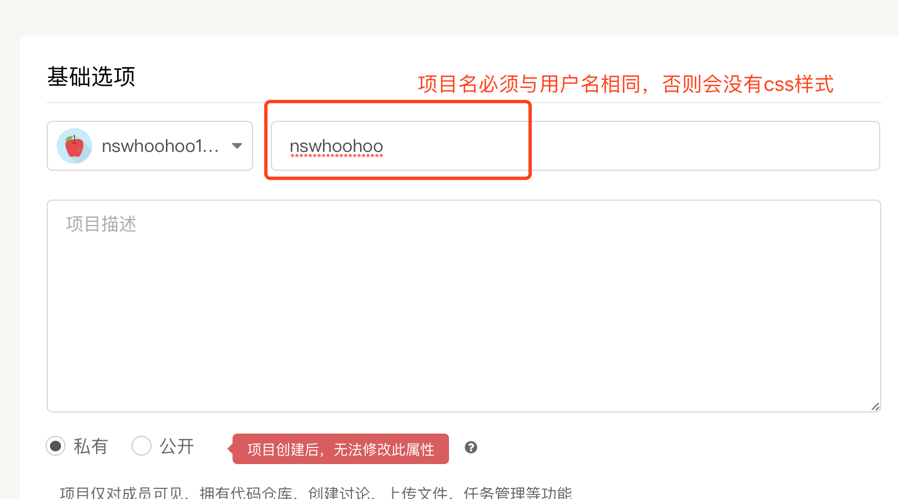
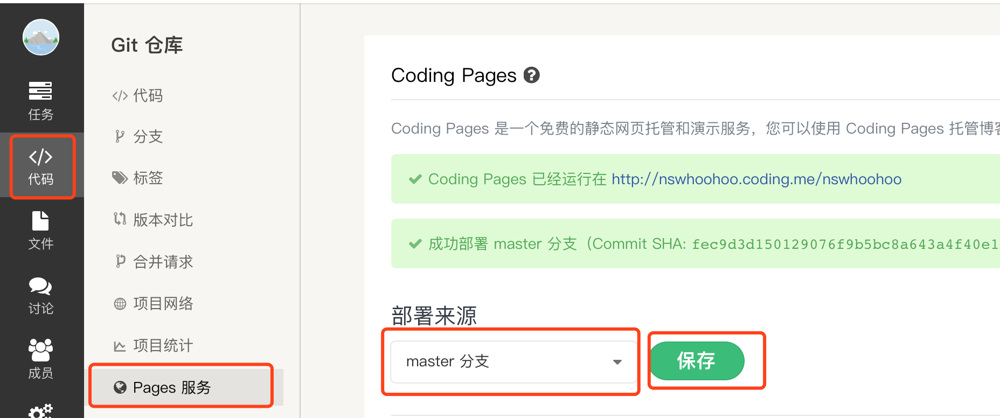

计算机程序员不是计算机，日常工作学习所积累的知识需要即使梳理，博客虽然是个“古老”的技术，但是对程序员的学习成长却是至关重要的。下面的教程就是给喜欢动手的程序员准备的，也是我自己的一个记录
<!--more-->
## 搭建个人技术博客（基础篇）

### 安装 Git + NodeJS 环境
Mac OS和Linux均自带git，Windows 下载地址：http://git-scm.com/downloads
NodeJS下载地址：http://nodejs.org

### 创建仓库
众所周知的原因，国内对github的访问速度时断时续，所以选择将博客同时部署在github和国内版的coding.net。
#### github部署
1. 创建仓库
用作github page的仓库要求仓库名与github的用户名相同。如我的用户名是`nswhoohoo`，所以仓库名就是
[nswhoohoo.github.io](nswhoohoo.github.io)<nswhoohoo.github.io>

2. 创建github page
选择Settings -> Options -> Github Pages

然后选择要发布的branch，保存仓库就建好了

#### coding.net部署
coding上的部署其实和github上是一样的
1. 创建仓库
coding.net上如果项目名还是要和coding用户名相同，否则页面样式不能显示。

2. 开启Pages服务
选择代码 -> pages服务 -> master分支 -> 保存


### Hexo配置
#### Hexo安装
打开terminal命令行，执行如下命令
``` 	
$ npm install -g hexo
```
#### 初始化博客
新建博客的文件夹（如/Users/HW/Documents/blog，以下教程都以这个目录为博客根目录），然后执行如下命令
```
$ hexo init
```
完成后会输出
```
INFO  Start blogging with Hexo!
```
根目录下会生成以下文件
```
source：# 用于存放我们用markdown编写的博文源文件和静态资源
themes：# 用于存放主题文件，每个主题也有自己的主题配置文件_config.yml文件
_config.yml：# 站点配置文件，用于配置博客信息，如作者，博客名称等
```
运行以下命令验证初始化成功
```
$ hexo server
```
启动后，在浏览器中打开 <http://localhost:4000/> 即可访问自己的博客，按Ctrl+C停止

默认的主题是landscape，如下

#### 创建新文章
运行以下命令
```
$ hexo new "新文章"
```
刷新 <http://localhost:4000>  即可看到新生成的文章

同时在`\source\_posts`目录下会生成一个"新文章.md"的markdown文件，可以用markdown编辑器来编写该文件，刷新 <http://localhost:4000> 即可看到修改后的结果。

打开这个文件
```
title: 搭建个人技术博客 #文章标题
date: 2017-09-11 14:48:00 #编写日期
tags: [教程, How-To] #文章标签，多于一项时用这种格式

# 正文，用markdown写

```
#### 生成静态网页
运行以下命令，将markdown文件生成静态网页
```
$ hexo generate
```
同时在`\Hexo`目录下会生成一个public文件夹，里面时生成的静态网页。

### 部署本地博客到GitHub和coding.net
运行以下命令，安装GitHub的自动部署插件
```
$ npm install hexo-deployer-git
```
修改博客根目录下的`_config.yml`文件，修改`Deployment`的内容为
```
# Deployment
## Docs: https://hexo.io/docs/deployment.html
deploy:
  type: git
  repo:
      github: https://github.com/nswhoohoo/nswhoohoo.github.io.git # 这里更换成自己的用户名
      coding: https://git.coding.net/nswhoohoo/nswhoohoo.git # 这里更换成自己的用户名
  branch: master
 ```
运行命令进行部署
```
$ hexo generate
$ hexo deploy
```
这里部署完成后，在浏览器中访问 <http://nswhoohoo.github.io> 就能看到本地调试好的博客。
> 这里会发现首页显示的文章是全文，这显然不是我们要的效果，我们要是是首页只显示摘要并显示`阅读全文`按钮，`markdown` 里加上个这串，默认就只会显示 `<!--more-->` 之上的内容了

### 域名绑定
#### github绑定
在`/source`文件夹新建CNAME文件，文件里只写上你的域名
```
nswhoohoo.me # 不加www
```
然后正常部署`hexo deploy`
> Github
#### coding绑定

### Hexo命令总结
#### 常用命令
```
hexo new "postName" # 新建文章
hexo generate # 生成静态页面至public目录
hexo server # 开启预览访问端口（默认端口4000，'ctrl + c'关闭server）
hexo deploy # 将deploy目录部署到GitHub
hexo help  # 查看帮助
hexo version  # 查看Hexo的版本
```

#### 命令简写
```
hexo n == hexo new
hexo g == hexo generate
hexo s == hexo server
hexo d == hexo deploy
hexo s -g # 生成静态文件并启动本地服务
hexo d -g # 生成静态文件并部署
```
